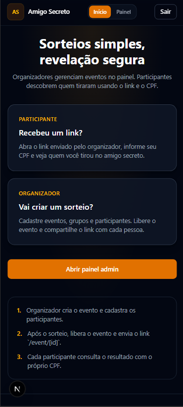
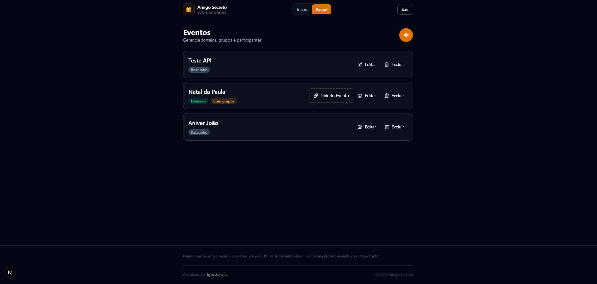
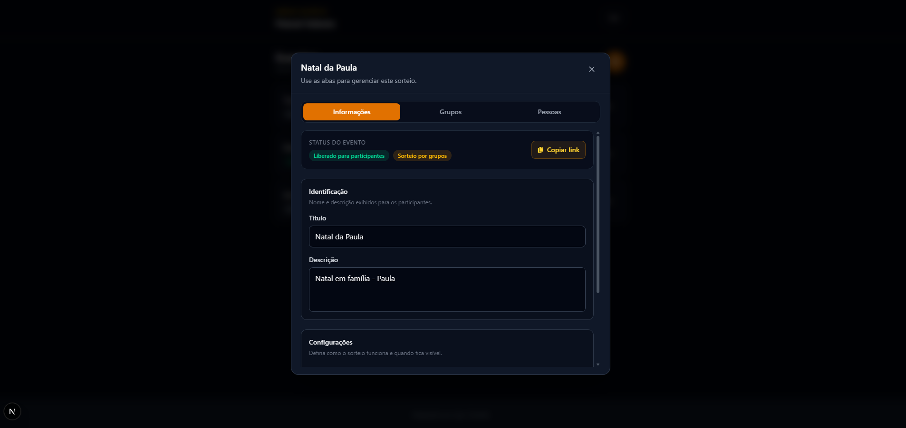
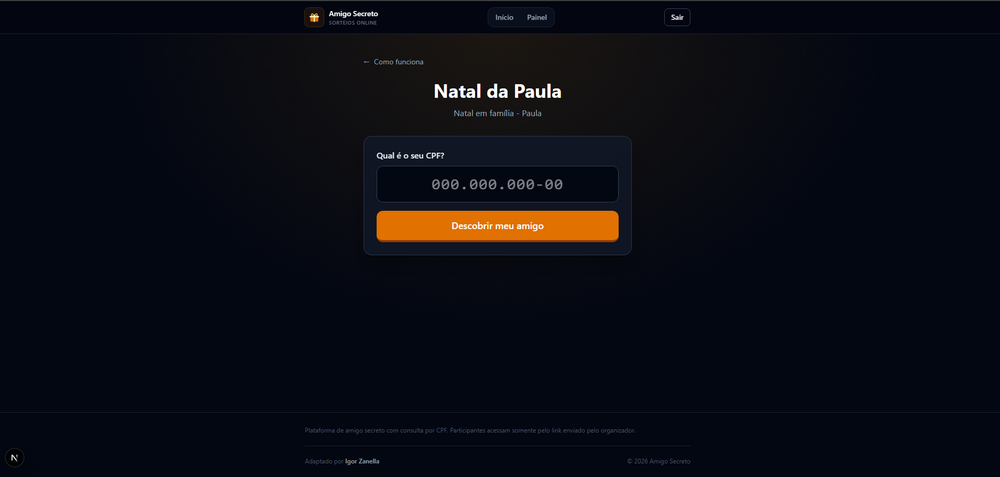

# Amigo Secreto

Front-end em **Next.js** para sorteios de amigo secreto. Organizadores cadastram eventos, grupos e participantes no painel admin; cada pessoa consulta quem tirou pelo link do evento e o CPF.

Projeto desenvolvido durante o curso da [B7Web](https://b7web.com.br/). O backend (Node.js + Prisma) fica em repositório separado.

## Capturas de tela

### Página inicial

Landing com instruções para participantes e organizadores.

<p align="center">
  
</p>

### Painel do organizador

Lista de eventos com status (rascunho / liberado), grupos e ações de editar, excluir e copiar link.

<p align="center">
  
</p>

Formulário do evento com abas para informações, grupos e participantes.

<p align="center">
  
</p>

### Área do participante

Consulta do sorteio pelo link `/event/[id]` e CPF.

<p align="center">
  
</p>

## Demo em 2 minutos

Roteiro rápido para apresentar o projeto no portfólio ou em avaliação do curso.

1. **Instale e configure o ambiente**

```bash
npm install
```

Crie `.env.local` na raiz (ou copie de `.env.example`):

```env
NEXT_PUBLIC_API=http://localhost:3333/
```

2. **Suba backend e front-end** — inicie a API do backend e, em outro terminal, rode `npm run dev`. Abra [http://localhost:3000](http://localhost:3000).

3. **Entre no painel admin** — acesse `/admin/login`. A senha é a data de hoje no formato `DDMMAAAA`. Exemplo para 15/06/2026: `15062026`.

4. **Monte um evento** — crie um evento, adicione grupos e participantes (com CPF) e marque **Liberar evento** quando o sorteio estiver pronto no backend.

5. **Teste a consulta** — abra `/event/[id]` (use o link copiado no painel), informe o CPF de um participante cadastrado e confira o resultado do sorteio.

> **Autenticação admin:** login simplificado para demo e projeto de curso (senha = data do dia). Não representa um modelo de segurança para produção.

## Tecnologias

| Camada | Stack |
|--------|--------|
| Framework | Next.js 16 (App Router, Turbopack) |
| UI | React 19, Tailwind CSS 4 |
| Linguagem | TypeScript |
| Validação | Zod 4 |
| HTTP | Axios |
| Auth | cookies-next 6 |
| Lint | ESLint 9 (flat config) |

## Requisitos

- **Node.js** 20+
- **npm**
- Backend da API em execução (CRUD e regras de negócio)

## Configuração

1. Instale as dependências:

```bash
npm install
```

2. Crie `.env.local` na raiz (ou copie de `.env.example`):

```env
NEXT_PUBLIC_API=http://localhost:3333/
```

Use a URL base do backend, com barra no final se for o padrão do servidor.

3. Suba o backend e, em seguida, o front-end:

```bash
npm run dev
```

Abra [http://localhost:3000](http://localhost:3000).

> **Backend:** o front depende da API para login, eventos, grupos, pessoas e consulta por CPF. Consulte o repositório do backend no portfólio.

> **Login admin:** senha no formato `DDMMAAAA` (data de hoje). Ex.: 15/06/2026 → `15062026`. Veja o passo a passo em [Demo em 2 minutos](#demo-em-2-minutos).

## Rotas

| Rota | Acesso | Descrição |
|------|--------|-----------|
| `/` | Público | Landing com instruções |
| `/event/[id]` | Público | Participante consulta por CPF |
| `/admin/login` | Público | Login do organizador |
| `/admin` | Autenticado | Painel de eventos |

**Fluxo**

1. Organizador entra em `/admin/login` e gerencia eventos em `/admin`.
2. Após o sorteio no backend, libera o evento e envia o link `/event/[id]`.
3. Participante abre o link, informa o CPF e vê o resultado.
4. Evento inativo → mensagem amigável; rota inválida → 404 customizado.

## Scripts

| Comando | Descrição |
|---------|-----------|
| `npm run dev` | Desenvolvimento |
| `npm run build` | Build de produção |
| `npm run start` | Servidor de produção |
| `npm run lint` | ESLint |
| `npm run typegen` | Tipos de rotas do Next.js |

Manutenção (upgrades):

| Comando | Descrição |
|---------|-----------|
| `npm run upgrade:next` | Codemod oficial do Next.js |
| `npm run upgrade:tailwind` | Migração Tailwind CSS |
| `npm run codemod:async-api` | `params`, `cookies()`, etc. async |
| `npm run codemod:eslint` | ESLint CLI (sem `next lint`) |
| `npm run codemod:zod` | Zod v3 → v4 |

## Estrutura do projeto

```
lib/
├── api/                # Axios, endpoints admin e site
├── types/              # Event, Person, Group...
└── utils/              # validações, formatação (CPF, Zod)
app/
├── admin/              # Login e painel (route groups)
├── event/[id]/         # Consulta do participante
├── components/
│   ├── ui/             # Button, InputField, Modal...
│   ├── admin/          # painel CRUD
│   ├── site/           # consulta participante
│   ├── layout/         # header, footer
│   └── brand/          # AppIcon
docs/
└── images/             # Screenshots para documentação
app/icon.svg            # Favicon (Next.js metadata)
```

- **`lib/`** — camada compartilhada: chamadas HTTP, tipos da API e utilitários.
- **`app/components/ui/`** — componentes visuais reutilizáveis.
- **`app/components/admin/`** — telas e formulários do organizador.
- **`app/components/site/`** — fluxo público de consulta por CPF.

## Produção

```bash
npm run build
npm run start
```

Requer o backend da API em execução para login, eventos e consulta por CPF.

## Créditos

Adaptado por **Igor Zanella**.

## Referências

- [Documentação do Next.js](https://nextjs.org/docs)
- [Learn Next.js](https://nextjs.org/learn)
